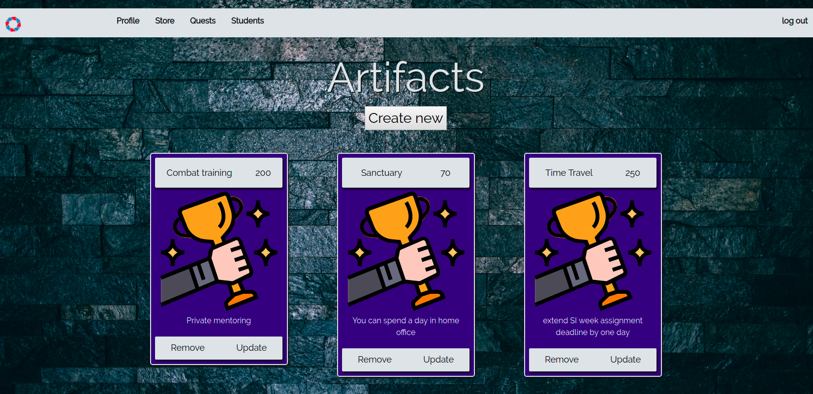

# questostore
Gamification system app to buy artifacts and achieve quests for Codecool students.
System allows Mentors to create and update new students, quests and articats. Back-end written in Java with use of httpServer 
Library, PosgtreSQL database, HTML5, CSS, JavaScript, jTwig and partially BootStrap in front-end.

